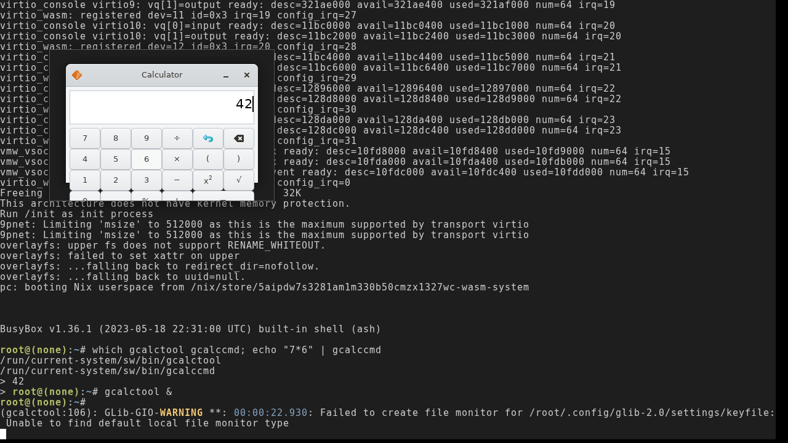

# gcalctool — browser visual acceptance: click 7 × 6 = 42

**Status: VERIFIED 2026-07-11 — on the PR #142 preview artifacts (commit
`2dd58db7`, the final artifact shape: gcalctool loads from the squashfs via
PATH at `/run/current-system/sw/bin`, deliberately NOT in the initramfs
extraBins — see the NOMMU contiguous-alloc note in the smoke), before merge.**

Verified on the headless-Chromium rig (`runtime/demo/web/` + `serve.mjs`,
SwiftShader GL) against the pr-142 preview's content-addressed artifacts:

- `echo "7*6" | gcalccmd` → **42** in the browser guest (the same engine
  check the headless CI gate runs — `runtime/demo/node/gcalctool-smoke.mjs`).
- `gcalctool &` maps the Calculator window: display entry + the basic-mode
  button grid loaded from `buttons-basic.ui`, its handlers autoconnected via
  `gtk_builder_connect_signals` → GModule → `dlopen(NULL)`/`dlsym` (#130
  Track C — gcalctool is the first app to *need* this path).
- Playwright clicks `7`, `×`, `6` + keyboard `Enter` (the `=` row is clipped
  by the compositor viewport): **the display reads 42**.
- No engine crash lines. One benign warning: GLib's keyfile settings backend
  can't create a file monitor (`Unable to find default local file monitor
  type`) — settings still read/write, they just don't hot-reload.
