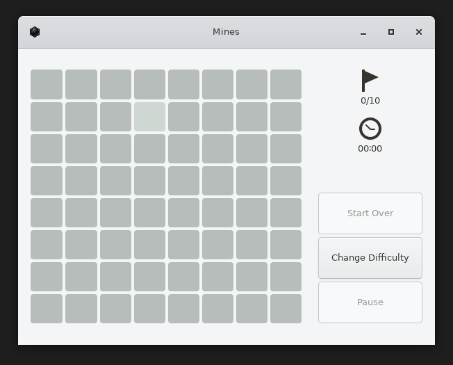
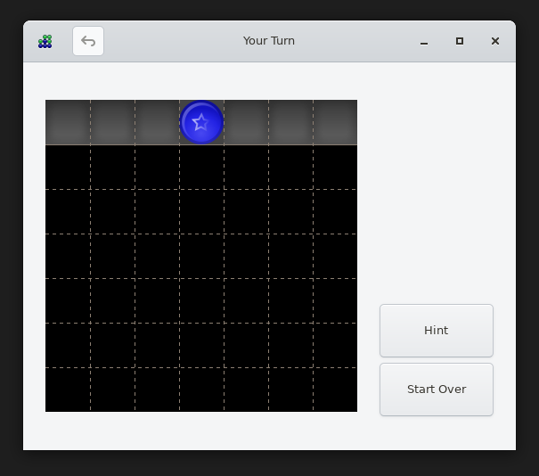
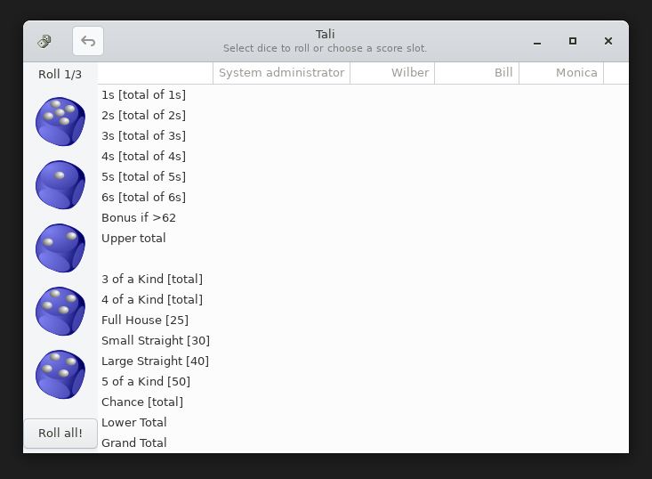

# GNOME games tier — browser visual acceptance

**Status: VERIFIED 2026-07-12 — ALL SIX games render on the browser rig.**
The first three landed in PR #144; the last three (gnome-mines, four-in-a-row,
tali) were unblocked by the gdk-pixbuf built-in SVG loader in PR #147 and
verified against its preview build.

Verified on the headless-Chromium rig (`runtime/demo/web/` + SwiftShader,
per-game boot). The tier's SVG-rendering chain (libcroco → librsvg 2.40 →
pango/cairo) is exercised by every piece drawn; the headless `rsvg-smoke.mjs`
gate covers the same chain CLI-side. No engine crash lines, no `Unable to load
image` for any of the six.

## Renders via librsvg's API (`rsvg_handle_*` → cairo)

These draw their pieces by calling librsvg directly; they worked from PR #144.

### gnome-mahjongg — full tile board (postmodern SVG theme), tile click-selected

### five-or-more — board + placed balls + the "Next:" SVG preview trio

### iagno — Reversi setup screen

## Renders via gdk-pixbuf's SVG loader (`gdk_pixbuf_new_from_file`)

These load `.svg` assets THROUGH gdk-pixbuf, which had no SVG loader on this
all-builtin guest — so before PR #147 four-in-a-row threw "Unable to load image"
(tileset, unplayable), tali showed blank dice, and gnome-mines' HUD icons were
blank. PR #147 compiles librsvg's `io-svg.c` into gdk-pixbuf as a built-in
loader (registered in all three of gdk-pixbuf-io.c's loader tables — the
init-builtin call, the `module()` extern decl, and the `try_module()` resolver),
so `gdk_pixbuf_new_from_file(".svg")` now sniffs → matches → renders through
librsvg. All three render below.

### gnome-mines — HUD flag + clock SVG icons (driven into an 8×8 game)

### four-in-a-row — board + checker tileset (blue star piece placed)

### tali — five SVG dice faces down the left rail

