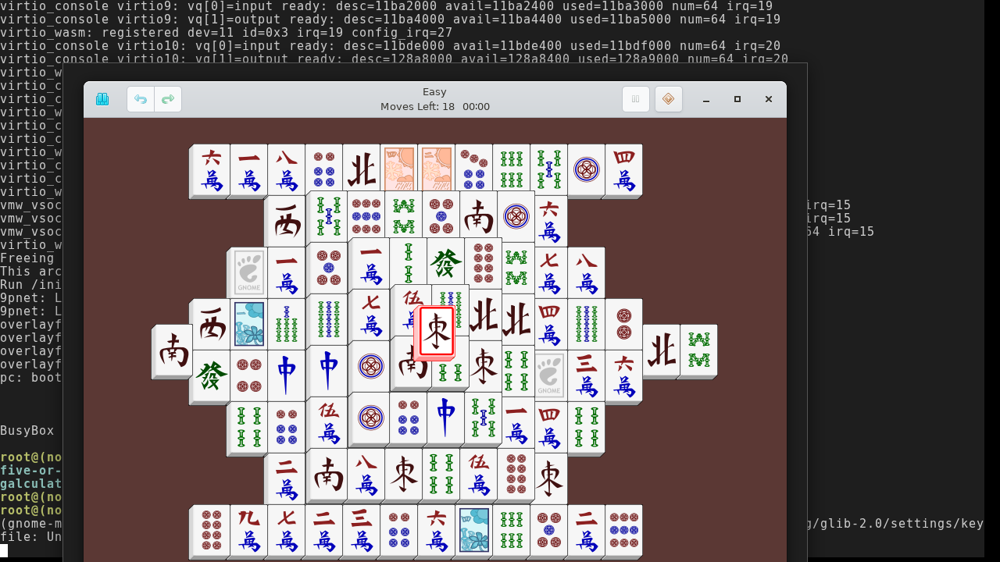
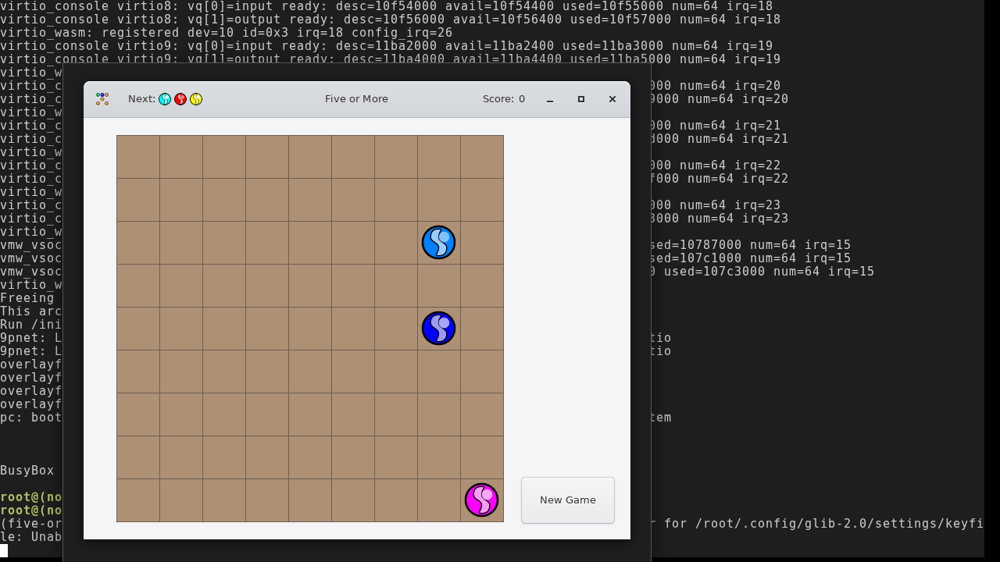
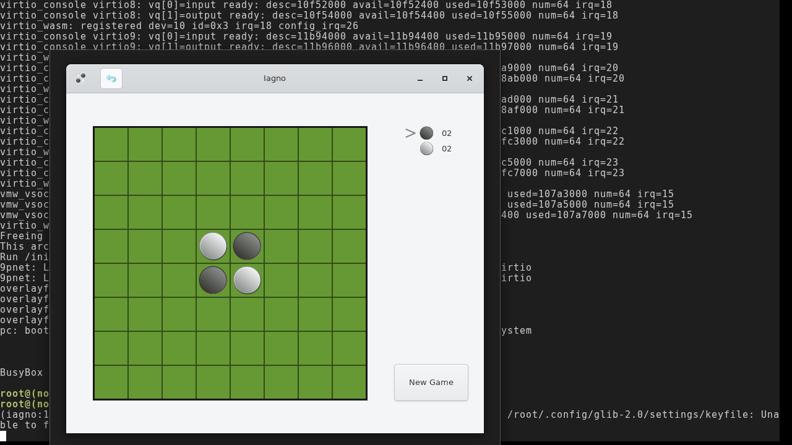

# GNOME games tier — browser visual acceptance

**Status: VERIFIED 2026-07-12 — three games render on the browser rig (PR #144
preview artifacts).**

Verified on the headless-Chromium rig (`runtime/demo/web/` + SwiftShader,
per-game fresh boot). The tier's SVG-rendering chain (libcroco → librsvg 2.40 →
pango/cairo → cairo-png) is exercised by every piece drawn; the headless
`rsvg-smoke.mjs` gate covers the same chain CLI-side. No engine crash lines,
no `Unable to load image` for any of these four.

## gnome-mahjongg — full tile board (postmodern SVG theme), tile click-selected

## five-or-more — board + placed balls + the "Next:" SVG preview trio

## iagno — green Reversi board with the four starting discs

## Why these three (and not gnome-mines / four-in-a-row / tali)

These render their pieces through **librsvg's API** (`rsvg_handle_*` →
cairo), which works. The deferred three load SVG **through gdk-pixbuf**,
which has no SVG loader on this guest (no `libpixbufloader-svg`, no
`loaders.cache` — verified in-guest): four-in-a-row throws "Unable to load
image" (tileset, unplayable), tali shows blank dice, and gnome-mines' HUD
icons (mine-counter flag, clock) are blank. All three are deferred to
**nix-wasm#146** (gdk-pixbuf SVG loader).
