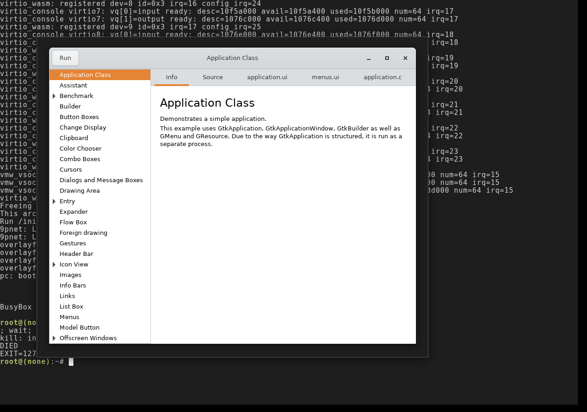

# gtk3-demo — browser visual render: verification record

**Status: VERIFIED 2026-07-11 — demo browser window renders in a real browser.**
(Closes the manual-check follow-up nix-wasm#124.)

Verified twice, independently:

- **Production** (pc on gh-pages, live channel image `minEngine: 10`): Eric
  launched the Wayland shell and ran `gtk3-demo` — the demo browser window
  draws (demo list + source viewer panes, Adwaita theme) and stays alive.
- **The headless-Chromium rig** (`runtime/demo/web/` + `serve.mjs`,
  SwiftShader GL, runtime at master `2d1ed94`): the screenshot above, captured
  while verifying the two browser-only engine bugs that had blocked exactly
  this window — #137 (browsers reject SAB-backed `TextDecoder` views in the
  dylink name parser) and #139 (dlsym'd raw exports need runtime canonical
  thunks under fpcast-emu). Both fixes are engine-side (`runtime/dylink.js`),
  shipped to pc via the ABI-10 vendor sync.

The "optionally, wire a Playwright visual check on a deploy" follow-up from
#124 shipped as the **`browser-smoke` CI job** (#140,
`runtime/demo/web/smoke.mjs`): every `nix-wasm.yml` run now boots the guest in
headless Chromium and runs `gtk3-demo &` as the dlopen workload, failing on
any engine crash line — so this check is no longer manual going forward.

Known non-working demos (expected, per #124): `glarea` (libepoxy built
no-GL). The `builder` demo's GModule wall is **gone** since Track C (#130) —
GtkBuilder autoconnect is proven end-to-end by galculator's click-to-42
(`m4-galculator-visual.md`).
