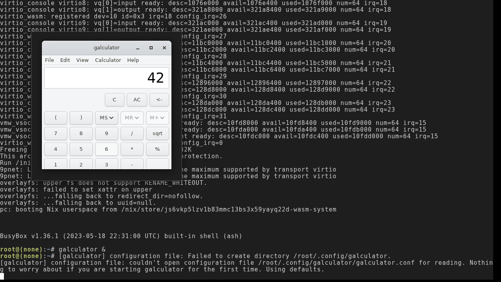

# M4 — galculator visual acceptance: click 7 × 6 = 42

**Status: VERIFIED 2026-07-11 — click-to-42 confirmed in a real browser.**



Verified on the headless-Chromium rig (`runtime/demo/web/` + `serve.mjs`,
SwiftShader GL, runtime at master `2d1ed94`, the live channel image artifacts):
boot to the shell, `galculator &` → a full GTK3 calculator window maps (menu
bar, display, button grid, Adwaita theme). Playwright mouse clicks on `7`,
`×`, `6` land through Greenfield → sommelier → wl_pointer → the GtkBuilder
**autoconnected** handlers (the 115 deferred `.ui` signals now resolve through
real GModule → `dlopen(NULL)`/`dlsym`, nix-wasm#130 Track C — no
`add_callback_symbol` workaround), and a keyboard `Enter` (the `=` button row
was clipped by the compositor viewport) evaluates: **the display reads 42**.
No engine crash lines, no GModule/signal-connect failures in the terminal log.
This also closes the note's original caveat era: the browser-only engine bugs
that used to sit between the green node selftest and a working window
(#137 SAB decode, #139 canonical dynSlot thunks) are fixed and CI-gated by the
browser smoke (#140).

The headless `galculator --selftest` gate is GREEN in the node harness
(`runtime/node/galculator-smoke.mjs` PASS):

```
GALCULATOR-SELFTEST: main_window=1 button_7=1 gtk_types=1 OK
```

It parses the real `.ui` files from `PACKAGE_UI_DIR` and runs the GTK widget
gobject class machinery through the fpcast-emu seam — but it is deliberately
**display-free** (see "Why selftest is display-free" below). The full galculator
**window render and click-to-42** is a MANUAL browser check via pc/Greenfield,
exactly like M0 and M3b — the node harness has no compositor (only a minimal `wl`
registry), so it cannot satisfy `gtk_init`'s display connection.

## What was built

`/bin/galculator` (wasm32-nommu, 2.1.4) — cross-built via the **existing nixpkgs
override** in `deps-overlay.nix` (reusing nixpkgs' three galculator patches plus
the M4 `--selftest` source patch), linking the cross GTK3 stack through the
shared binaryen `--fpcast-emu` post-link seam. It is in the guest
`environment.systemPackages` (not just the initramfs `extraBins`) so its store
path — and thus its `$out/share/galculator/ui/*.ui` files, loaded at runtime from
the hardcoded `PACKAGE_UI_DIR` (`$(datadir)/galculator/ui` = the store path) —
rides the served `/nix` closure. Two modes:

- `--selftest` (headless CI gate, automated): before `gtk_init`, parse the real
  `MAIN_GLADE_FILE` (`main_frame.ui`) and `BASIC_GLADE_FILE`
  (`basic_buttons_gtk3.ui`) with GLib's GMarkup XML parser and assert the real
  widget objects are present — `GtkWindow "main_window"` and
  `GtkToggleButton "button_7"` — then `g_type_class_ref` those widget classes
  (display-free gobject class_init through the fpcast seam). Prints
  `GALCULATOR-SELFTEST: main_window=1 button_7=1 gtk_types=1 OK`.
- default (visual, MANUAL): `gtk_init` → full galculator UI → `gtk_main`. Maps a
  real wayland toplevel via GTK's wayland backend, painted via cairo (wl_shm).

## Why selftest is display-free (and why it does NOT call GtkBuilder)

The original plan proposed `gtk_builder_add_from_file` to load the `.ui` files.
That does NOT work headless: GtkBuilder **instantiates** the objects in a `.ui`,
and constructing a `GtkWindow`/`GtkToggleButton` requires a `GdkDisplay`. The
cross GTK3 is **wayland-only** (no broadway/X11 offscreen backend), and the node
harness has no compositor, so widget construction aborts fatally with
`Gtk-ERROR: Can't create a GtkStyleContext without a display connection`
(observed during bring-up). The selftest therefore mirrors the M3b `gtk-hello`
precedent: it proves the real assets + the real GTK type machinery WITHOUT
instantiating a widget — a genuine, non-stub proof that the `.ui` files reached
`PACKAGE_UI_DIR`, are well-formed GtkBuilder XML defining the expected widgets,
and that the GTK widget classes initialize through the fpcast seam.

## Acceptance (M4 project goal)

**Click-to-42 proof**: in-guest, click `7 × 6 =` on the galculator keyboard and
read `42` in the display. This confirms GTK input event handling (wl_pointer
button events from the browser), galculator's algebraic engine (`calc_basic.c`),
and the display update path.

## Verification procedure (manual)

```sh
# 1. Build the artifacts.
echo password | sudo -S nix --extra-experimental-features 'nix-command flakes' \
  build .#vmlinux .#wasm-initramfs .#wasm-store-manifest --print-out-paths

# 2. Point the browser demo at them and serve with COOP/COEP (SharedArrayBuffer).
ln -sfn /path/to/artifacts runtime/web/artifacts && node runtime/web/serve.mjs

# 3. In a browser (with the pc/Greenfield compositor wired up), boot to a root
#    shell and run waylandproxyd, then launch galculator:
/bin/waylandproxyd &
sleep 1
WAYLAND_DISPLAY=wayland-0 /bin/galculator

# 4. CONFIRM:
#    a. A GTK3 calculator window appears — button grid, display, menu bar.
#    b. Click: 7  ×  6  =
#    c. The display reads 42.
#    Close the window (× button or Ctrl-Q) — gtk_main exits cleanly.
```

~~Until a person runs the browser check and confirms the rendered window and
arithmetic, this note stays PENDING.~~ Verified 2026-07-11 — see the status
block at the top. The rig procedure that replaced the manual steps above:
serve `runtime/demo/web/` with the channel artifacts symlinked, drive headless
Chromium (`--use-angle=swiftshader --enable-unsafe-swiftshader`) with
Playwright, type into the terminal, click the compositor canvas (sommelier is
autostarted from inittab — no manual waylandproxyd step anymore).
